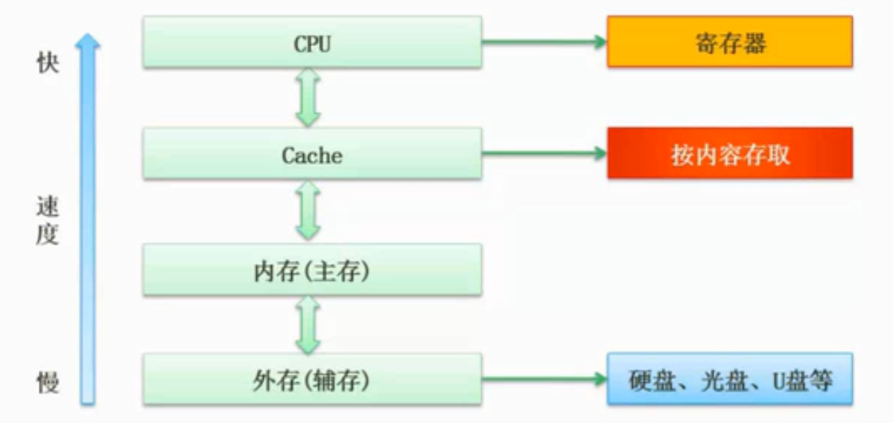
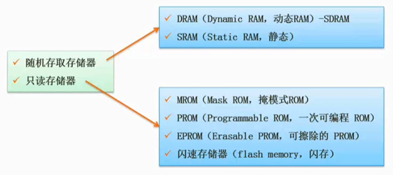
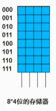
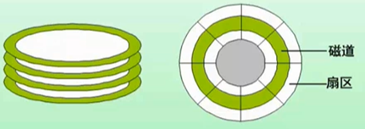
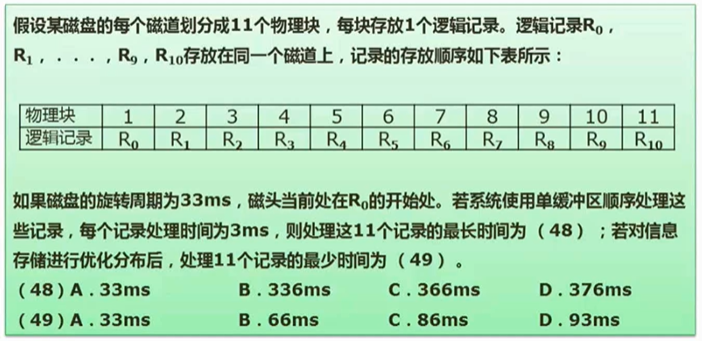

```yaml
title: 计算机组成与体系结构
author: samin
date: 2021-07-15
```

# Flynn 分类法

根据指令流和数据流进行分类

| 体系结构类型 | 结构 | 关键特性 | 代表 | 
| --- | --- | --- |--- |
| 单指令流单数据流 SISD | 控制器部分：1；处理器：1；主存模块：1 || 单处理器系统（单片机） |
| 单指令流多数据流 SIMD | 控制器部分：1；处理器：多个；主存模块：多个|各处理器以异步的形式执行同一条指令| 并行处理机；阵列处理机；超级向量处理机|
| 多指令流单数据流 MISD | 控制器部分：多个；处理器：1；主存模块：多个 |被证明不可能，至少是不实际| 目前没有，有文献称流水线计算机为此类|
| 多指令流多数据流 MIMD | 控制器部分：多个；处理器：多个；主存模块：多个 | 能够实现作业、任务、指令等各级全面并行 |多处理机系统；多计算机（集群） |

# CISC 与 RISC

| 指令系统类型 | 指令 | 寻址方式 | 实现方式 | 其他 |
|---|---|---|---|---|
| CISC（复杂）| 数量多，使用频率差别大，可变长格式 | 支持多种 | 微程序控制技术（微码） | 研制周期长 |
| RISC（精简）| 数量少，使用频率接近，定长格式(长度一样)，大部分为,单调期指令，操作寄存器（寄存器快，速度快），只有 Load/Store 操作内存 | 支持方式少 | 增加了通用寄存器；硬布线逻辑控制为主；适合采用流水线 | 优化编译，有效支持高级语言 |

# 存储系统



CPU：运算器、控制器、寄存器

速度越慢的存储容量越小

解决不同存储介质速度不一致的问题；Cache一般是 KB / MB 级别（按内存存取，按块存取，相联存储模式比寻址模式快），内存（主存）是 GB 级别

## Cache

- 提高 CPU 数据输入输出的速率，突破冯诺伊曼瓶颈（CPU与存储系统间数据传送带宽限制）

- 在计算机的存储系统体系中，Cache 是除寄存器外，访问速度最快的层次

- 使用 Cache 改善系统性能的依据是程序的局部性原理

如果以 h 代表对 Cache 的访问命中率， t1 表示 **Cache 的周期时间**， t2 表示**主存储器周期时间**，以读操作为例，使用 **Cache + 主存储器 的系统的平均周期**为 t3，则：

t3 = h X t1 + (1-h) X t2

其中，（1-h）又称为失效率（未命中率）

> 假设 h 为95%，t1 为 1ns，t2 为 1000ns，求 t3
> 1 * 95% + (1-95%) * 1000 = 50.95 ns
> t3 为 50.95 ns

## 局部性原理

- 时间局部性

```
int j,s=0;
// 一共被执行一百万次
for (i=1;i<1000;i++)
    for (j=1;j<1000;j++)
        // s 和 j 被频繁调用，这时候不会存入主存，而是在 Cache 中被频繁调用，这就体现了时间局部性
        s+=j;

printf("result is: %d",s);
```

- 空间局部性

体现在程序访问数组结构变量中每个元素的时候

- 工作集理论
  
工作集是进程运行时被频繁访问的页面集合

## 主存

### 分类



### 编址



8*4 存储器，有8个存储单元，每个存储单元可存储 4 个 bit

地址单元数量 = 大的地址 - 小的地址 + 1 = （ 大的地址 + 1 ） - 小的地址

内存地址从 AC000H 到 C7FFFH ，共有 112 K个地址单位，
如果该地址内存按字（16bit）编址，由28片存储器芯片构成。已知构成此内存的芯片每片有 16K 个存储单元，则该芯片每个存储单元存储 4 位。

> 计算技巧 C7FFFH 加 1 再进行减法，K为 2的10次方
> ( 112K * 16 bit ) / ( 28 * 16K * x ) = 1

## 磁盘结构与参数 *




信息存储在磁道上面，磁道又分为扇区，扇区是磁盘的最小组成单位。

存取时间 = 寻道时间 + 等待时间（ 平均定位时间 + 转动延迟 ）

> 寻道时间：磁头移动到磁道所需的时间
> 等待读写的扇区转到磁头下方所用的时间



磁盘旋转不会停，会一直匀速运动，由于单缓存区的限制，每个数据读取时间为33/11=3ms，前面10条记录每个记录的处理时间为 36ms（旋转磁头+读取时间+处理时间），最后一个记录的处理时间为33ms，36*10+6=366

答案：C 

修改数据的存储位置，修改为处理完上一个记录可以刚好处理下一个记录，转两圈即可

答案：B

# 流水线技术

# 校验码

# 并行处理