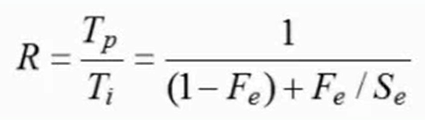
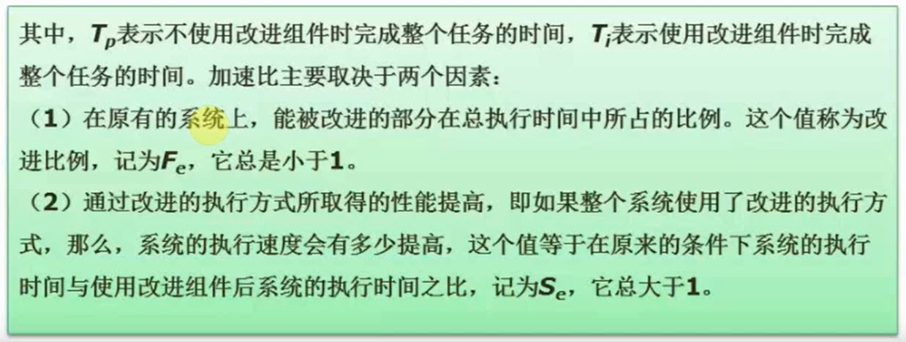

```yaml
title: 系统配置与性能评价
author: samin
date: 2021-07-16
```

# 性能指标

- 字长和数据通路宽度 计算机32位和64位指的就是字长，也就是计算机一次性可以处理的二进制位数

- 主存容量和存取速度 存取速度越快，CPU 执行效率越高

- 运算速度

    - 主频与 CPU 时钟周期

    - CPI 与 IPC

    - MIPS 与 MFLOPS 
      MIPS = 指令条数 / （执行时间 * 10^6） = 主频 / CPI = 主频 * IPC 
      MFLOPS = 浮点操作次数 / （执行时间 * 10^6）

- 吞吐量与吞吐率

- 响应时间与完成时间

- 兼容性

# 阿姆达尔（Amdahl）解决方案 *

二八定律，80% 的时间在使用 20% 的功能

对系统中某组件采用某种更快的执行方式，所获得的系统性能的改变程度，取决于该组件被使用的频率，或所占总执行时间的比例。加速比计算公式如下：





> 阿姆达尔有快捷解题思路，不需要套用这个方法，记住以下公式:
> 原处理总时间 / 优化后总时间 = 优化倍数  

# 性能评价方法

## 时钟频率法

片面性大，只看到了 CPU 的处理速度，最古老的评价方法
手机的主频高内核多，安卓8核高主频还不如苹果双核低主频的效果
CPU 时钟频率高，性能并不一定好

## 指令执行速度法

MIPS，每秒可以执行指令的数量，只衡量了加法指令

## 等效指令速度法（吉普森混合法）

指令执行速度法的改进，多种指令的执行速度求均值

## 数据处理速率法（PDR）

考虑了指令执行速度和主存存取速度，因为主存的存取速度往往是 CPU 的处理瓶颈

## 综合理论性能法（CTP）

美国为了限制部分国家购买高性能的计算机而出现的衡量方法

一样只考虑执行速度和主存存取速度

## 基准程序法（跑分软件）

考虑了指令执行速度、主存存取速度、硬盘 IO、显卡等多维度的方面

- Dhrystone 基准程序

- Linpack 基准程序

- Whetstone 基准程序

- SPEC 基准程序

    - SPECmark（SPEC分数）
      
    - SPECint（SPEC整数）
      
    - SPECfp（SPEC浮点数）
      
    - SPECrate（SPECint_rate、SPECfp_rate）

- TPC 基准程序

    - TPC-A: OLTP 环境下的数据库和硬件的性能
      
    - TPC-B: 不包括网络的纯事务处理，模拟企业计算环境
      
    - TPC-C: 联机订货系统
      
    - TPC-D: TPC-H和TPC-R：决策支持系统
    
    - TPC-E: 大型企业信息服务系统
      
    - TPC-W: 通过Internet 进行市场服务和销售的商业行为
    
# 性能检测方法

- 软件监控：使用软件对系统性能数据进行采集分析，此方法会消耗较多的系统资源

- 硬件监控：使用专用硬件设备对系统性能数据进行采集分析，使用于高负载的计算机系统