```yaml
title: 操作系统
author: samin
date: 2021-07-18
```

# 进程管理

## 进程的状态

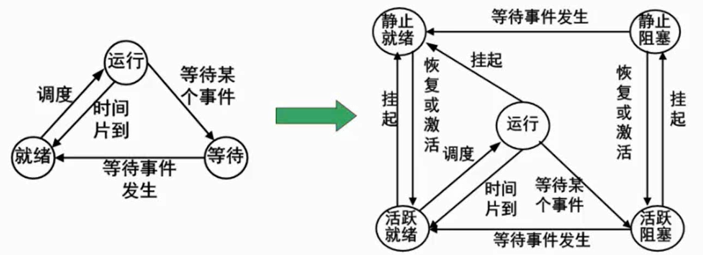

### 以前的进程状态

- 运行：需要的所有资源和 CPU 资源都有的情况

- 就绪：有需要的所有资源无 CPU 资源

- 等待：缺某种或所有资源（外设交互、用户指令）和 CPU 资源

### 现在的进程状态

程序成熟发展以后，三种进程状态不够用，有人为干预进程状态，提出了五态模型

运行状态不变，活跃就绪对应就绪状态，活跃阻塞对应等待状态，增加了静止就绪和静止阻塞

## 前趋图 * 

和PV操作结合考察

前趋图是用来描述程序行为执行的顺序关系及约束关系

## 进程的同步与互斥

PV操作的分析前提

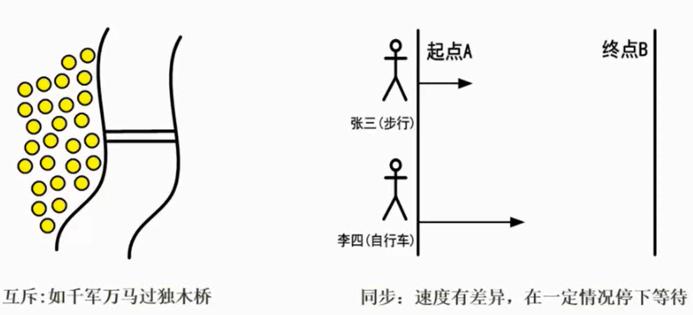

同步和异步、互斥与共享

同步和互斥没有直接关系

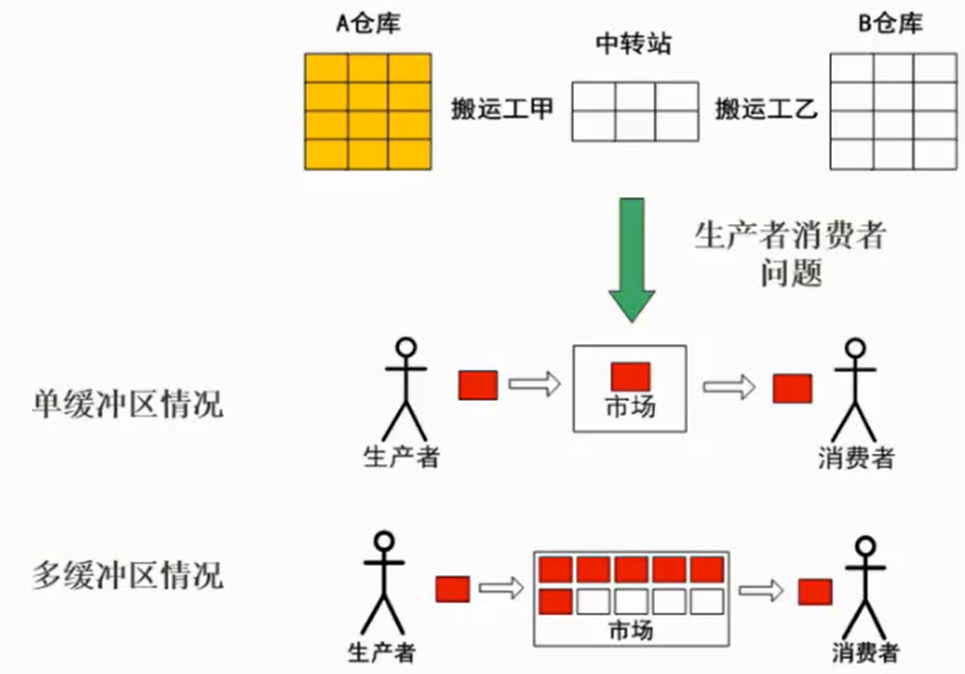

分析清楚同步和互斥点

## PV 操作

- 临界资源：进程间需要互斥方式对其进行共享的资源，如打印机、磁带机等

- 临界区：每个进程中访问临界资源的那段代码成为临界区（是代码段）

- 信号量：是一种特殊的变量 P（S）V（S） ， S 就是信号量

PV操作是两大原子操作的组合

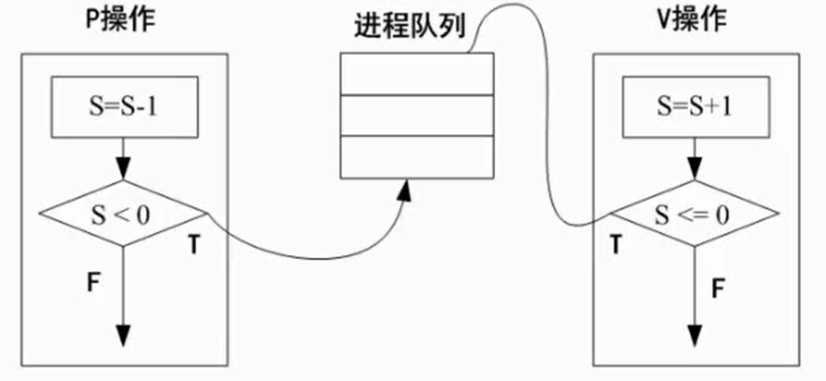

信号量不为 0 的时候，开始执行操作 P 是对信号量 -1 ， 一般是为了进入循环等待 V 是对信号量 +1 ， 一般是为了唤醒行为动作

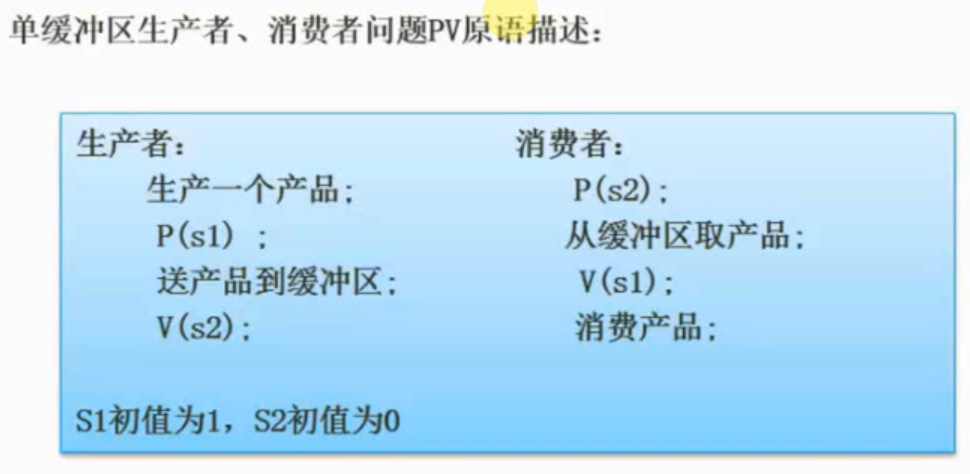

P(S1). 生产产品， S1 = S1 - 1 = 0，S1没有小于 0，可以继续执行操作 V(S2). 送产品到缓存区，S2 = S2 + 1 = 1
> 这时候有进程生产产品 S1 = S1 - 1 = -1，S1 小于 0，所以进入等待区 P(S2). 从缓存区取产品，S2 = S2 - 1 = 0，S1 没有小于 0，可以继续执行操作 V(S1). 消费产品，S1 = S1 + 1 = 1
> 如果最开始执行消费者，因为 S2 等于 0，S2 = S2 - 1 = -1，S1 小于 0，进入等待区

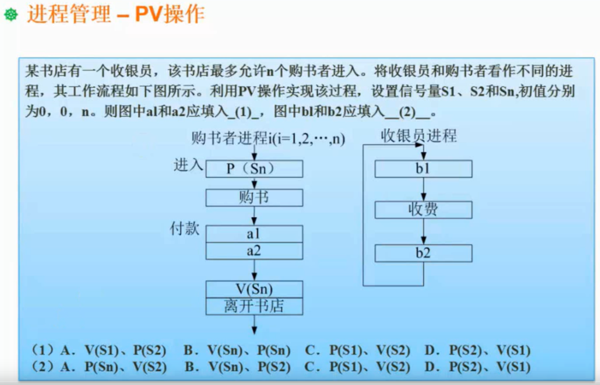

答案：A、C

1. Sn 的 PV 操作就是为了满足”最多允许n个购书者进入“
2. a1 和 b1 分别是 V(S1)和 P(S1) 操作，代表有人开始付款，唤醒收银动作
3. a2 和 b2 分别是 P(S2)和 V(S2) 操作，代表完成收银动作，继续等待新一轮的付款动作

## PV操作和前趋图结合

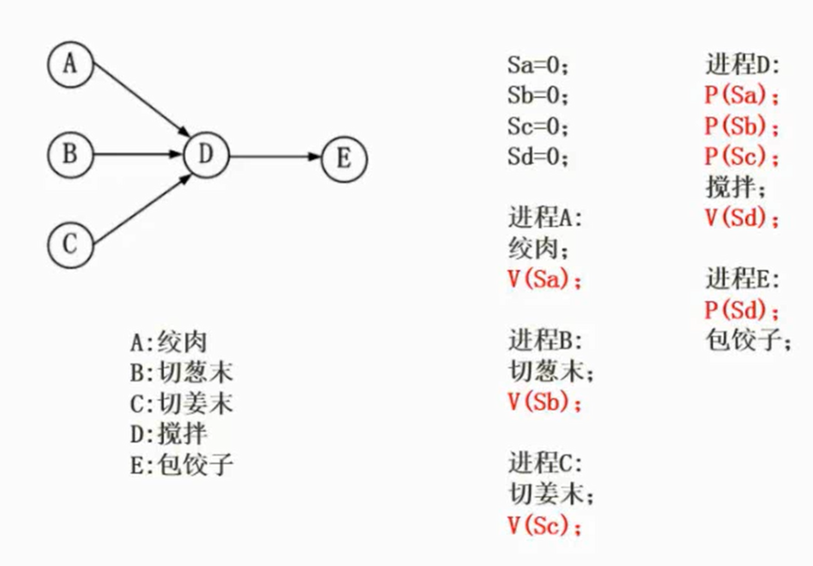

1. 进行完 V(Sa)、V(Sb)、V(Sc)，代表已经完成绞肉、切葱末和切姜末
2. 搅拌被唤醒，进行 P(Sa)、P(Sb)、P(Sc) 操作（有点像解锁），然后进行 V(Sd)，代表已经完成搅拌
3. 开始最后的包饺子，同时执行 P(Sd)

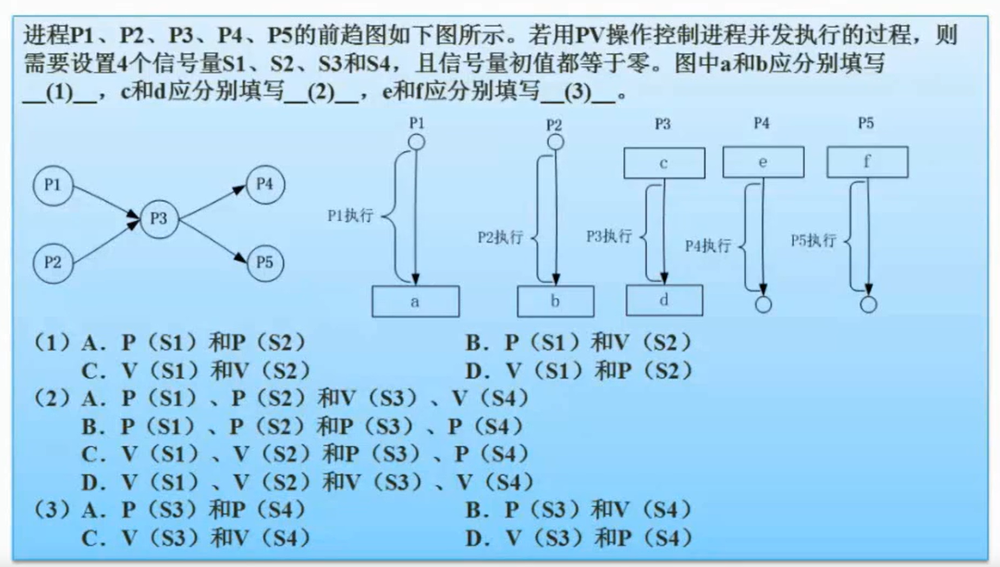

答案：C、A、A

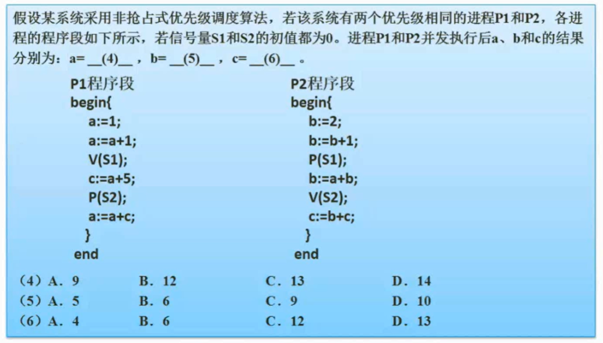

非抢占式优先级调度算法的意思是调度算法不受任务优先级影响，所以进程执行顺序为：P1 -> P2 -> P1

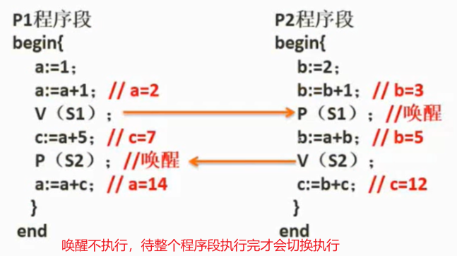

答案：D、A、C

## 死锁问题

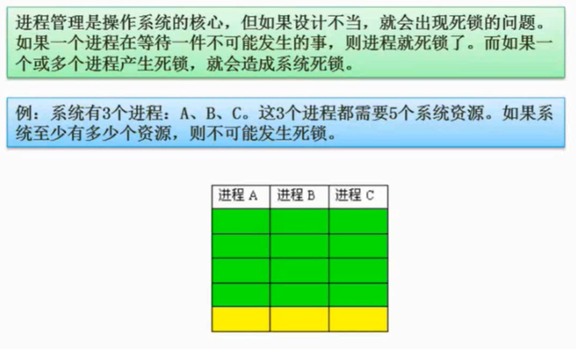

3 * 4 + 1 = 13，至少需要 13 个系统资源，不可能发生死锁。（低于 13 个系统资源是可能会发生死锁）

至少需要 k*(n-1) +1 个系统资源不会发生死锁（K为进程数，n为需要的系统资源数）

### 死锁的预防与避免

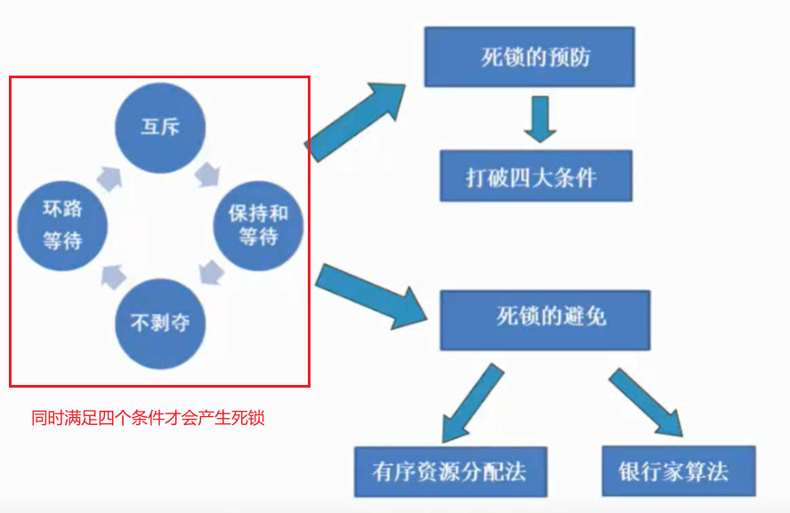

有序资源分配法：分别分配给不同进程，资源利用率低，不够灵活

银行家算法


# 存储管理

## 块式存储

内存分为几个固定大小的块，每个块中只包含一个进程

缺点：碎片多，已经淘汰

## 页式存储

组成：页号 + 页内地址

高级程序语言使用逻辑地址；运行状态，内存中使用物理地址

考察逻辑地址与物理地址之间的转换

页表对应逻辑地址和物理地址

优点：利用率高，碎片小，分配及管理简单 缺点：增加了系统开销（地址转换）；可能产生抖动现象

> 页内块号也叫页帧号

## 段式存储

组成：段号 + 段内地址

段式管理把主存分为一段段的，每一段的空间又要比一页的空间小很多

段表对应逻辑地址和物理地址

优点：多道程序**共享内存**，各段程序修改互不影响 缺点：内存利用率低，内存碎片浪费大

## 段页式存储

结合了页式和段式的优点

优点：空间浪费小、存储共享容易、存储保护容易、能动态连接 缺点：由于管理软件的增加，复杂性和开销也随之增加，需要的硬件以及占用的内容也有所增加，使得执行速度大大下降

## 快表


页表、段表是放在内存中，快表在 Cache 中

## 页面淘汰算法

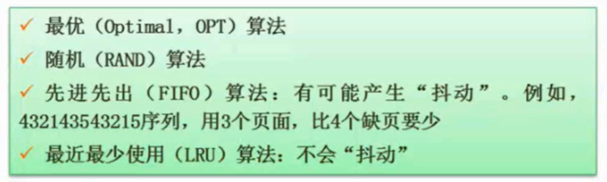

OPT 是定制化的算法，RAND 算法比较简单，FIFO 和 LRU 最常考

抖动指`页面调度过度频繁发生`

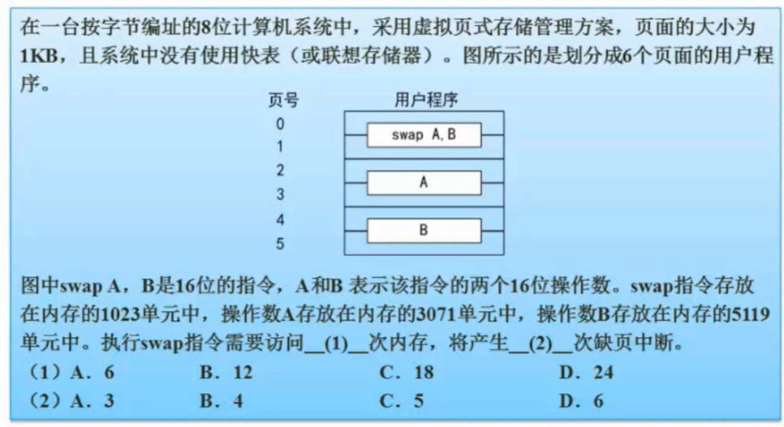

## 索引文件结构

# 设备管理

# 文件管理

# 作业管理

