```yaml
title: 计算机网络 
author: samin
date: 2021-07-26
```

# 七层协议

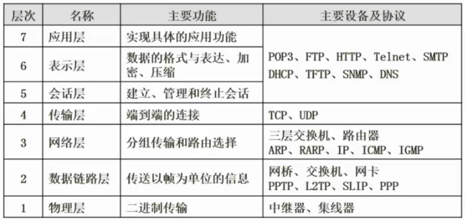

中继器（RP repeater）是连接网络线路的一种装置，常用于两个网络节点之间物理信号的双向转发工作。 中继器主要完成物理层的功能，负责在两个节点的物理层上按位传递信息，完成信号的复制、调整和放大功能，以此来延长网络的长度。

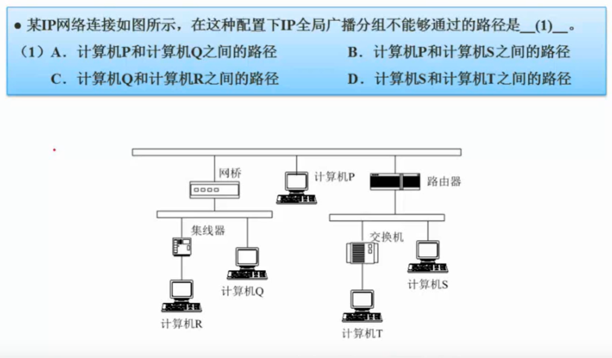

答案：B

# 网络技术标准与协议

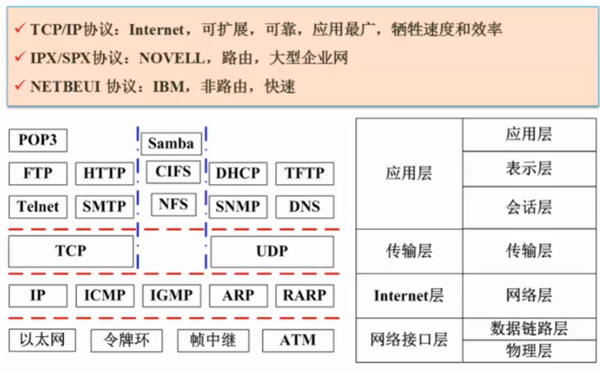

中间即可用 TCP 又可以用 UDP 协议的是文件传输协议

## TCP 三次握手

## DHCP 协议

客户机/服务器模型

固定分配、动态分配、自动分配

169.254.x.x 和 0.0.0.0 特殊ip，当计算机是这个IP的时候说明没连上 DHCP 服务器

## DNS 协议

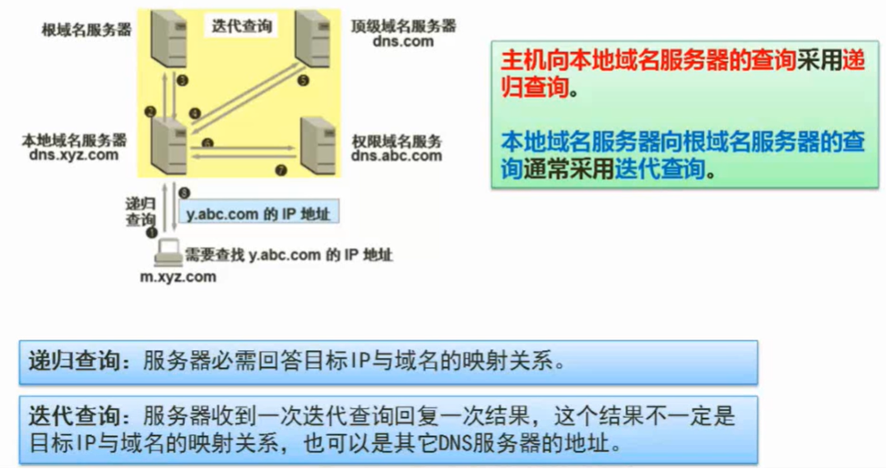

递归查询是不停的查询更多的 DNS 服务器寻找映射关系

根域名服务器一般采用迭代查询方式

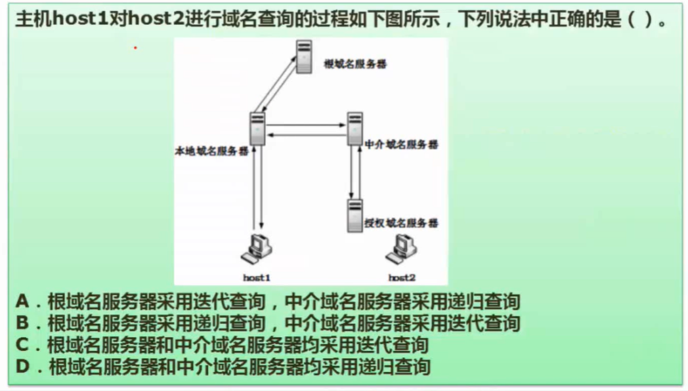

答案：A

# 网络规划与设计

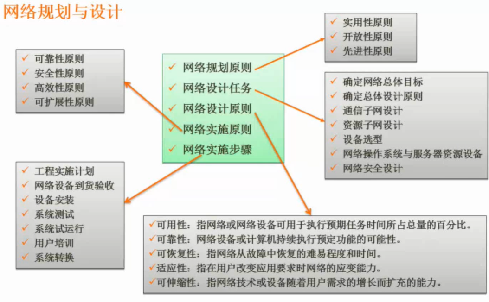

## 逻辑网络设计

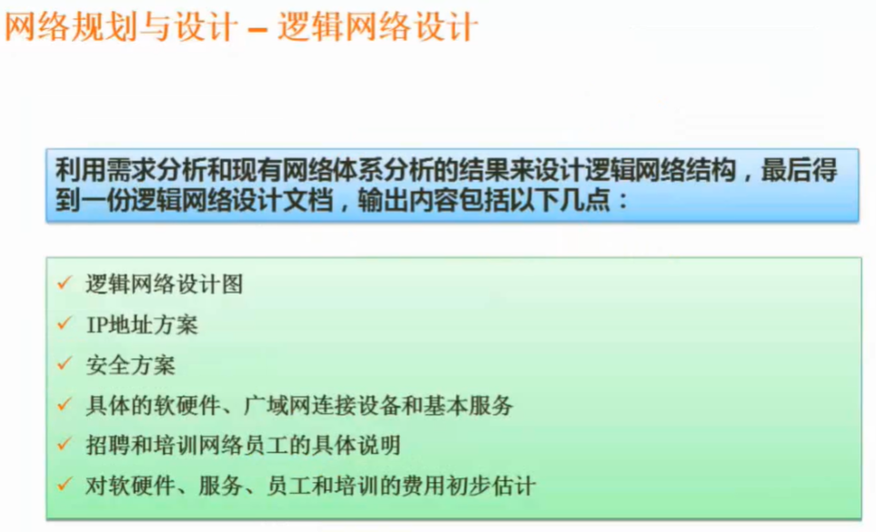

## 物理网络设计

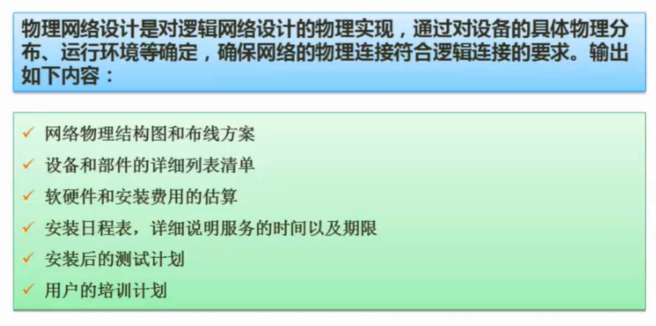

## 网络分层设计

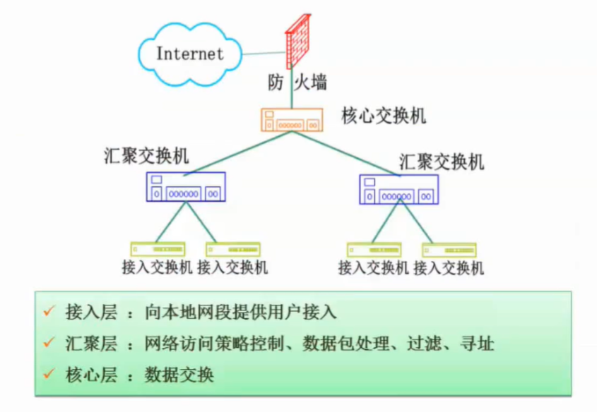

# 无线网

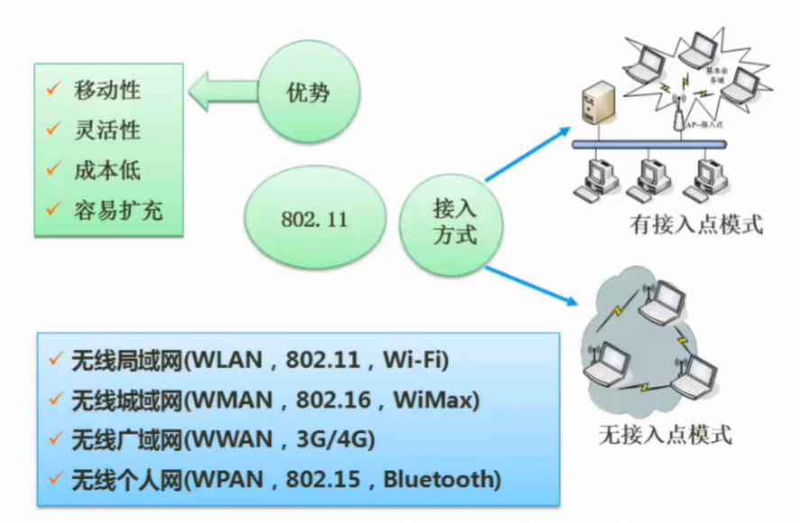

ZigBee（紫峰）也是无线个人网

# 网络接入技术

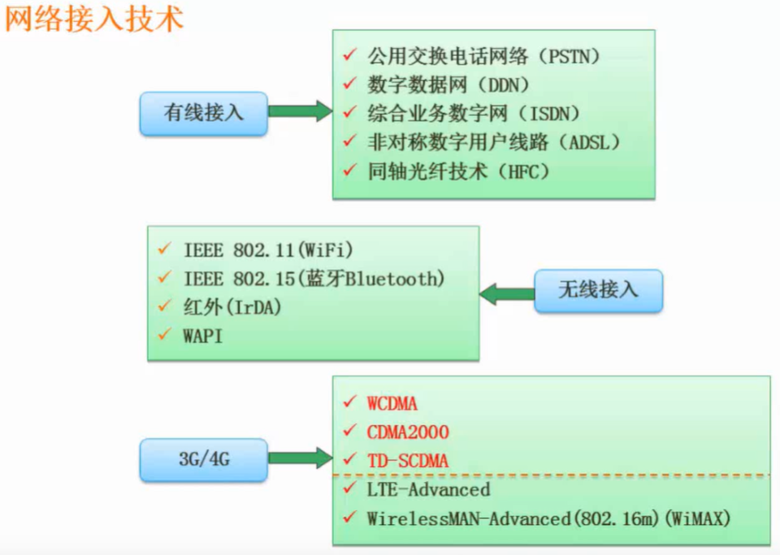

ADSL 是用电话线上网

光纤的上下行速度比 ADSL 快很多

# 网络存储技术

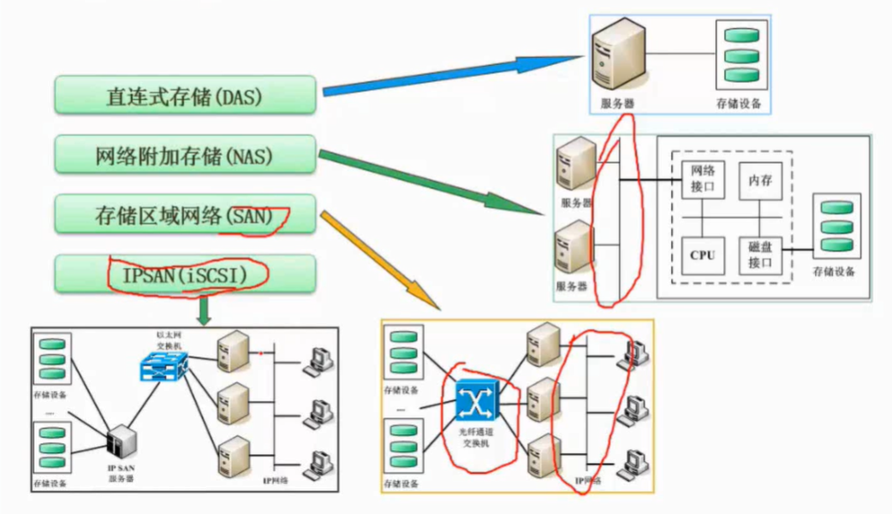

- 直接存储在服务器本地中；业务不复杂的单体服务一般用 DAS
缺点是多台服务器的情况下，需要用到文件存储功能的时候，都需要在一台服务器中进行文件的交互

- 多台服务器通过网络接口进行文件存储
缺点是网络既要跑业务数据，又要跑文件传输，在备份的时候会网络崩溃

- 把存储网络和业务网络分开，两种网络不会互相影响
缺点是成本高

- 考虑了成本，是 SAN 的折合方案

# 磁盘阵列（RAID）

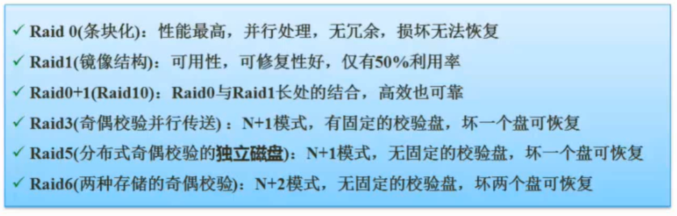

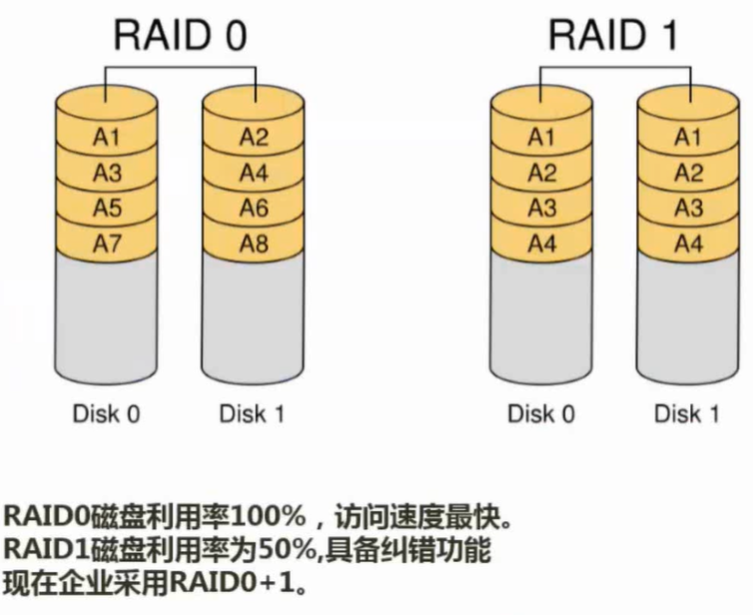

- RAID0 是可以并行把一个文件往两个硬盘去写，读也是可以并行读

- RAID1 会冗余数据容错

- RAID3 的校验盘坏了没影响，如果其他盘坏了，则可以用校验盘去替换坏掉的盘

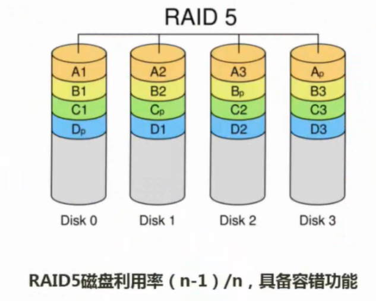

- RAID5 的校验盘是不固定的，RAID3 的校验盘频繁写（每个盘数据变化都要修改校验盘）容易坏

# IPv6

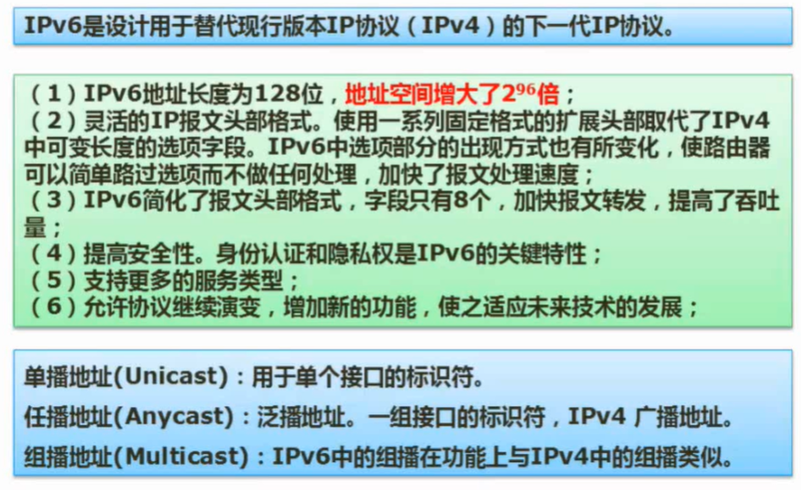

# 物联网

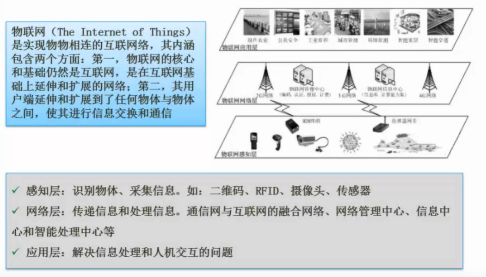

## RFID

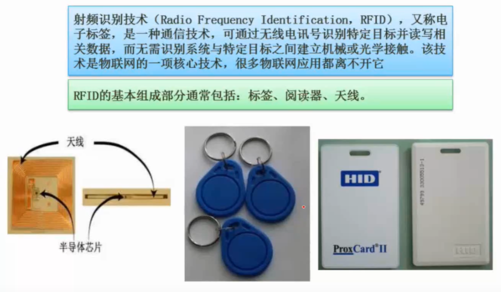

## 二维码

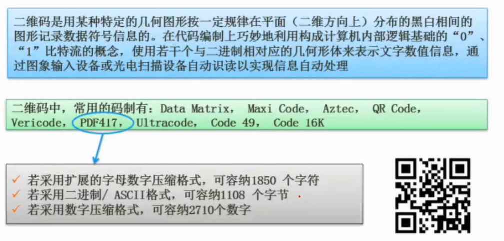

不同的编码格式存储的字符容量不同

## 传感网

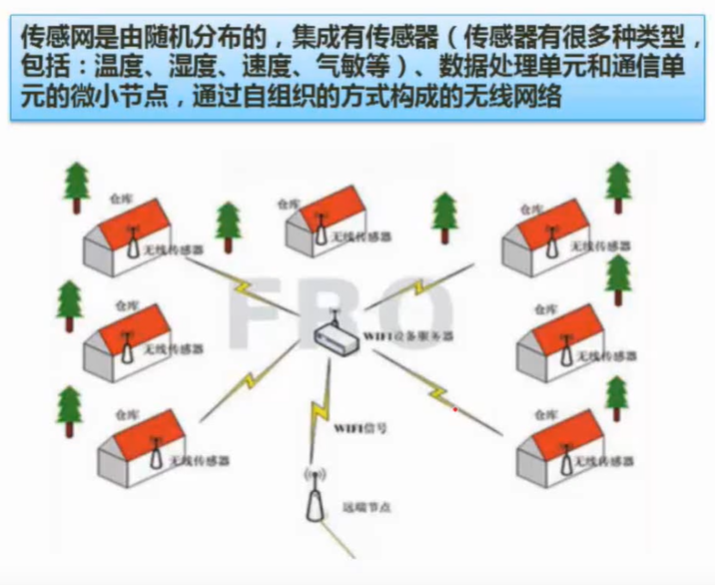

采集数据

## M2M


可以完成场景联动
