```yaml
title: 企业信息化战略与实施
author: samin
date: 2021-07-28
```

# 信息与信息化的概念

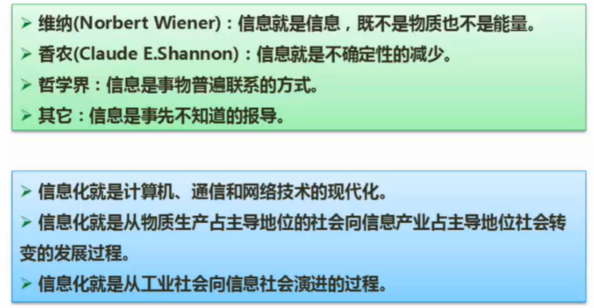

IT界最认可的是**香农**

# 信息系统的概念

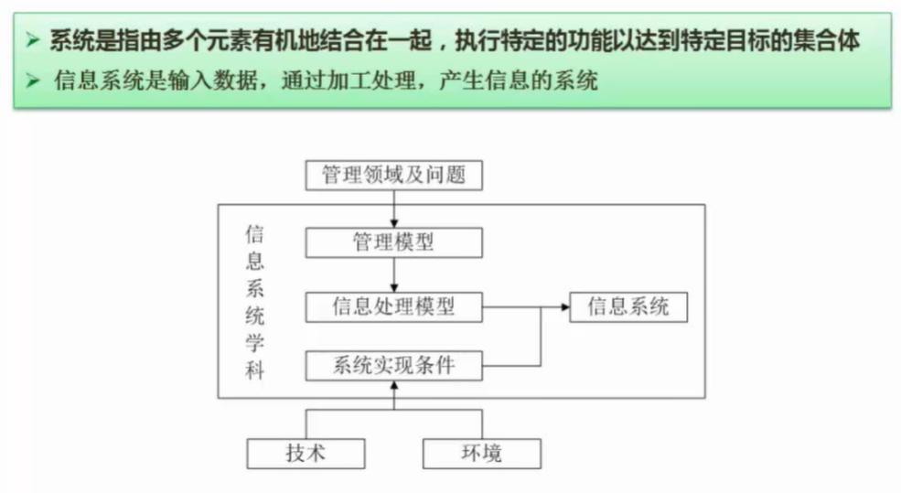

就算是人工做的，符合"输入->加工处理->输出"流程的，就是信息系统

# 信息系统的类型

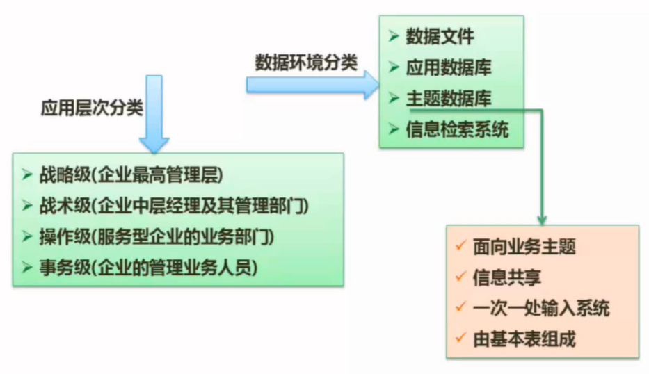

# 信息系统战略规划的方法

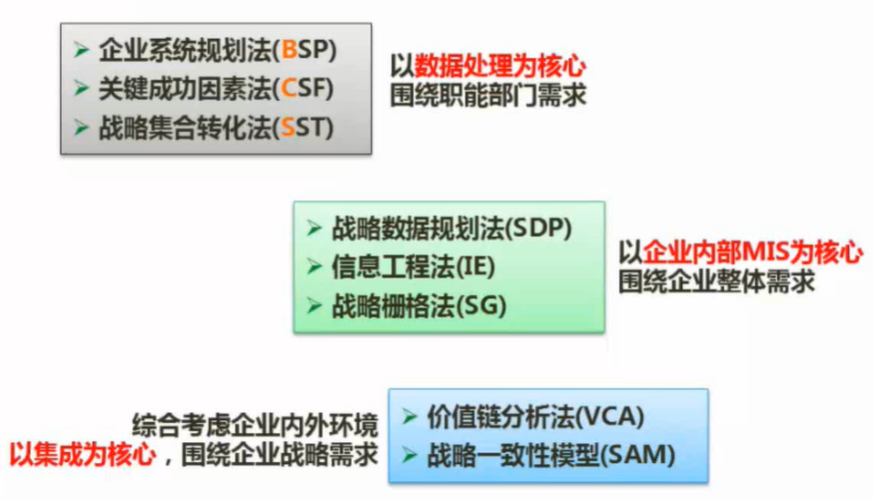

BSP、CSF、SST（以数据处理为核心）

SDP、IE、SG（以企业内部MIS为核心）

> Management Information System 管理信息系统

VCA、SAM（以集成为核心）

# 政府信息化与电子政务

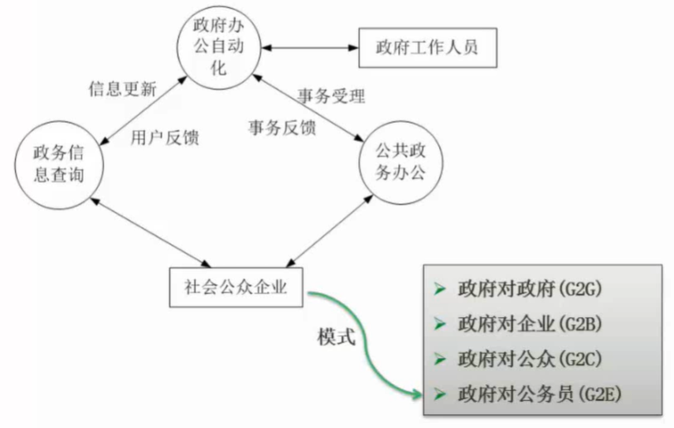

# 企业资源计划（ERP）

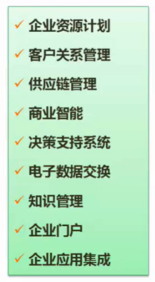

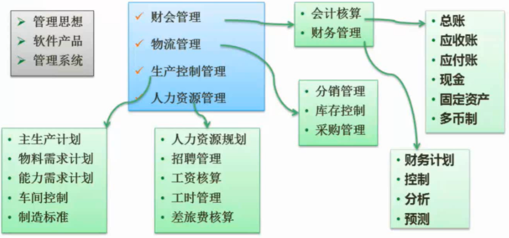

ERP 的前身是 MRP（物料管理系统） 

实施难度：

1. 结构复杂
2. 技术层次
3. 管理思想
4. 损害个人利益（国情）

# 客户关系管理（CRM）

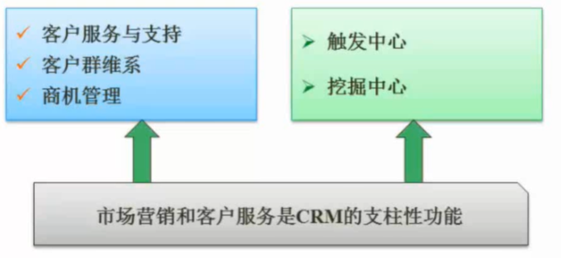

移动联通需求大，需要维护和客户的关系

自动推送对应运营短信，促进服务交易

# 供应链管理（SCM）

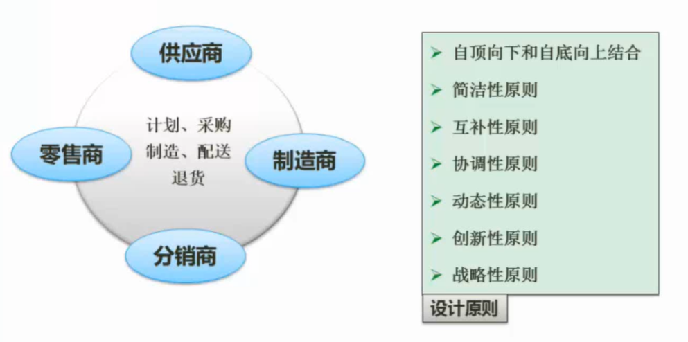

ERP 打通了内部的供应链

SCM 是打通合作企业间的关系

让 1+1 大于 2

0 库存计划，让物料直接上生产线

# 商业智能（BI）

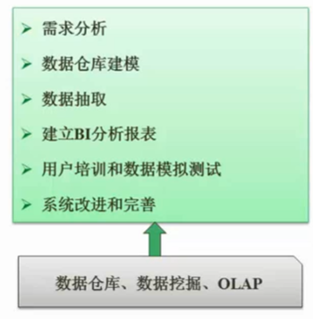

# 电子数据交换（EDI）

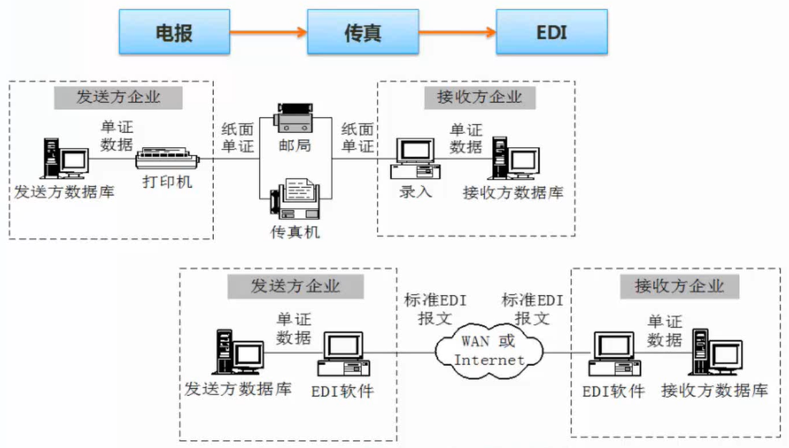

促进`无纸化`

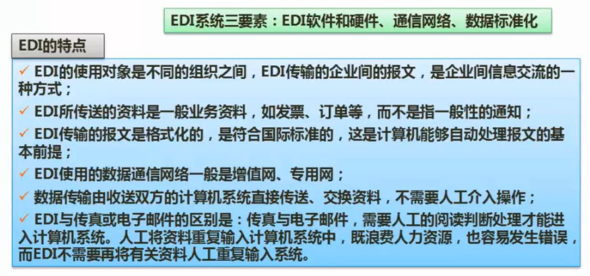

# 企业应用集成

解决信息孤岛的问题

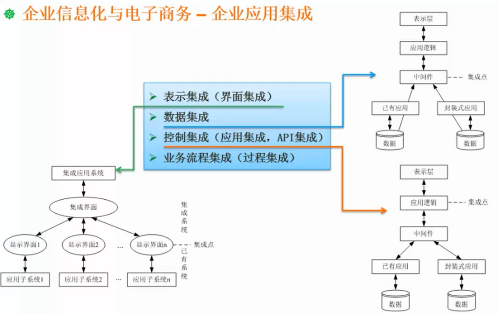

能够通过案例分析知道使用哪种方式进行集成

- 界面集成
hao123就是界面集成

- 数据集成

- 控制集成
考虑业务逻辑的整合

- 业务流程集成
处理业务逻辑集成，还要考虑优化

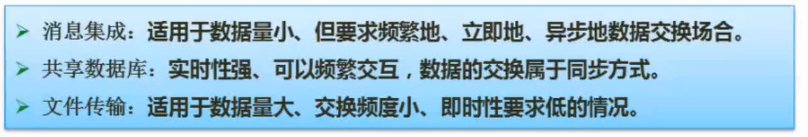

# 电子商务

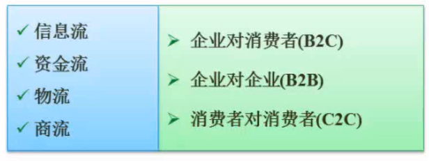

四流（信息流是核心，资金流和物流是辅助）

三种类型

O2O 线上线下（线上购买线下体验）

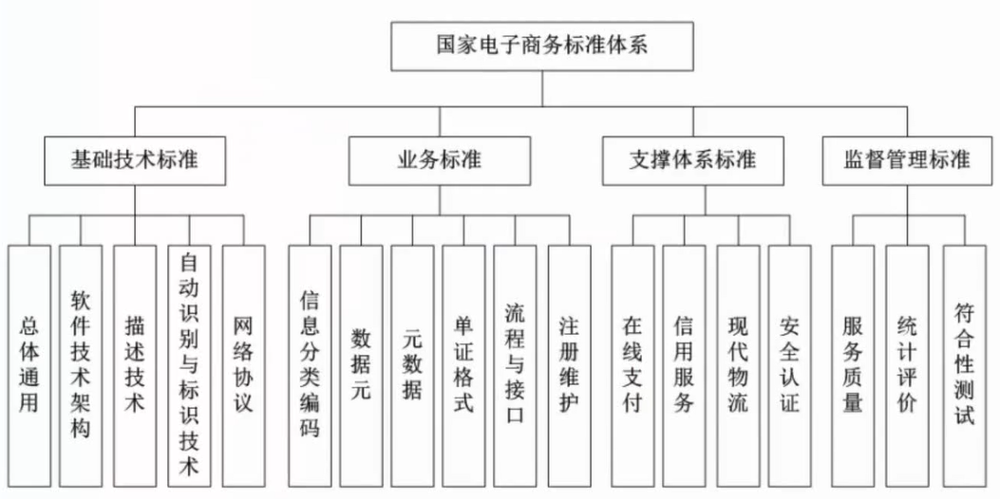