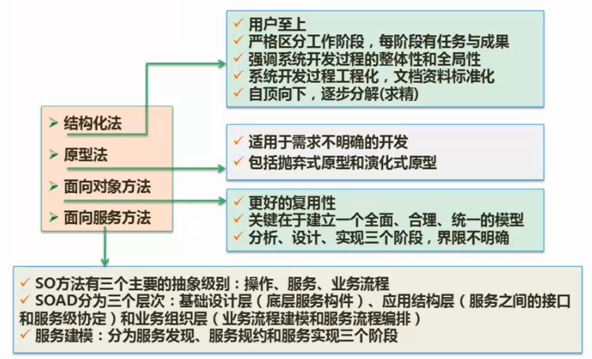
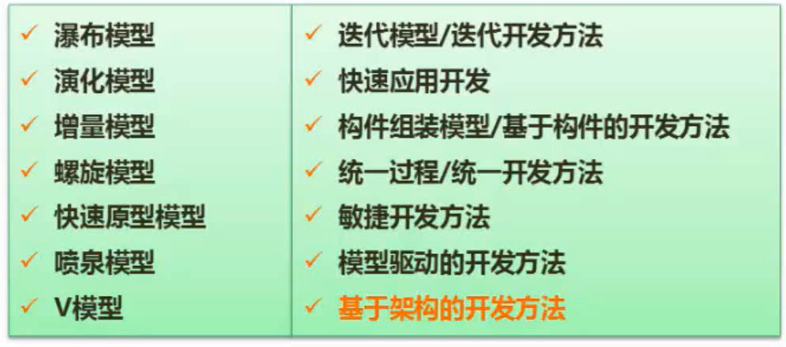
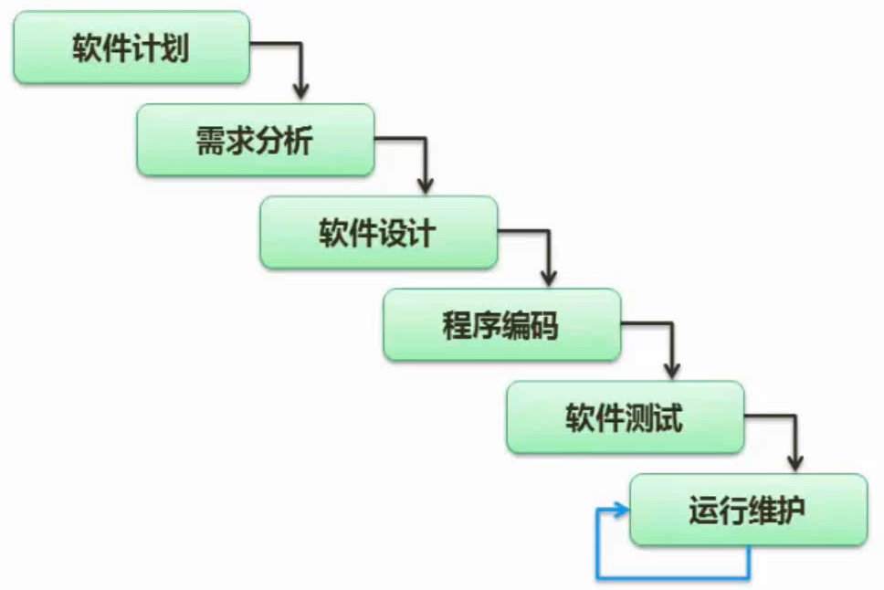
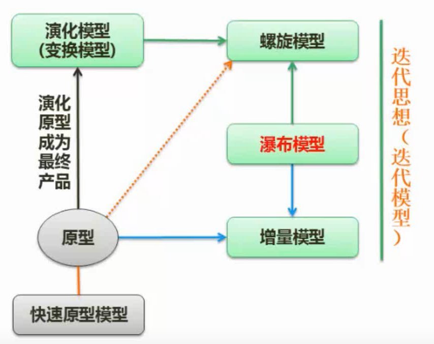
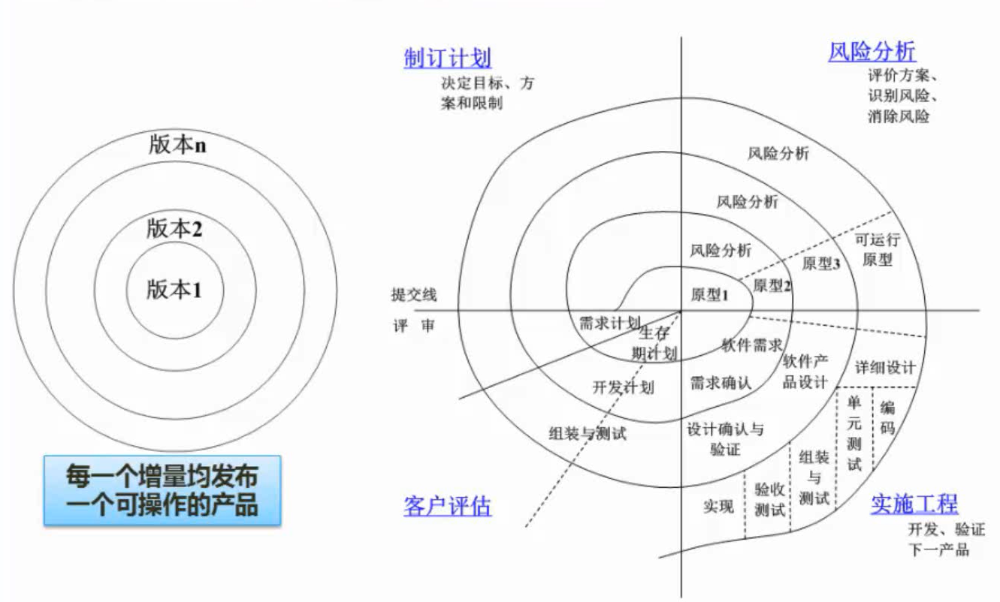
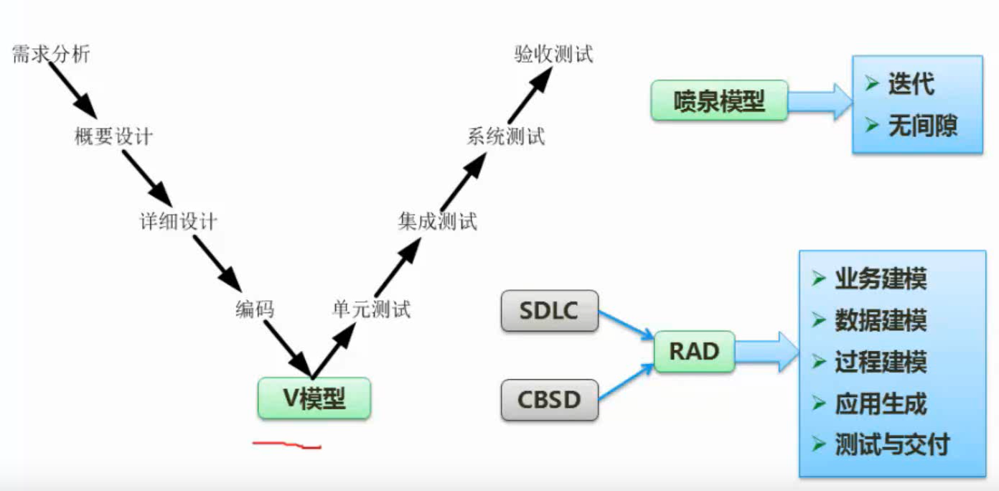

```yaml
title: 软件工程 
author: samin
date: 2021-08-03
```

# 开发方法



结构化法的缺点是一旦开发完成，流程固定，难以迭代

原型法比较解决敏捷开发

# 开发模型



## 瀑布模型（SDLC）



结构化方法模型、成本高、开发周期长

定义阶段、开发阶段、维护阶段

## 其他经典模型



原型法：先快速开发一个原型，用于展示，用于沟通

## 螺旋模型



引入了风险分析

## V模型

