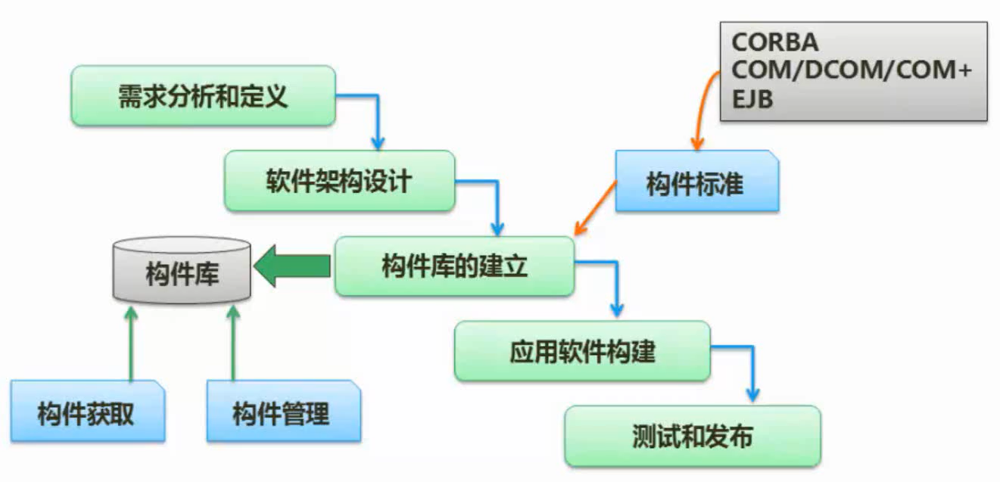
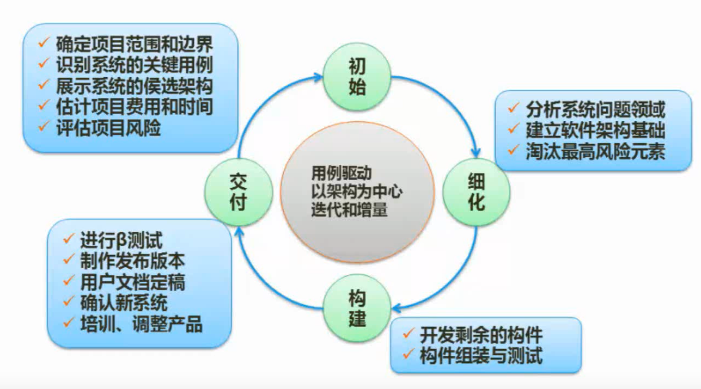
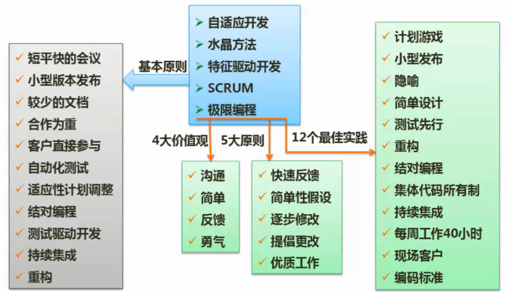
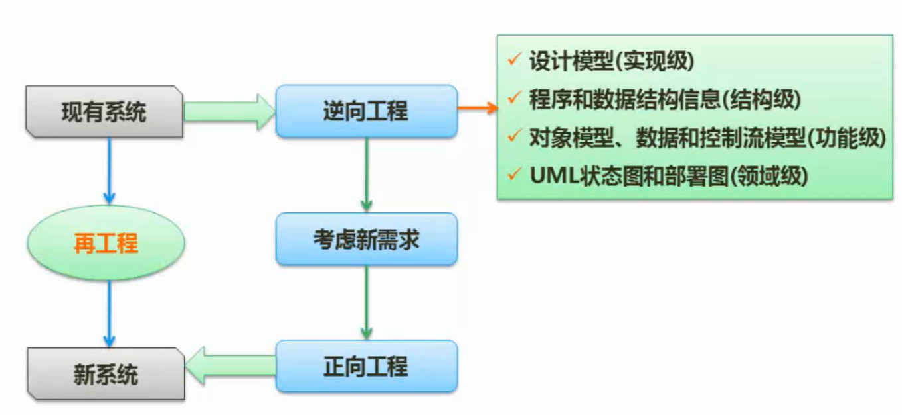
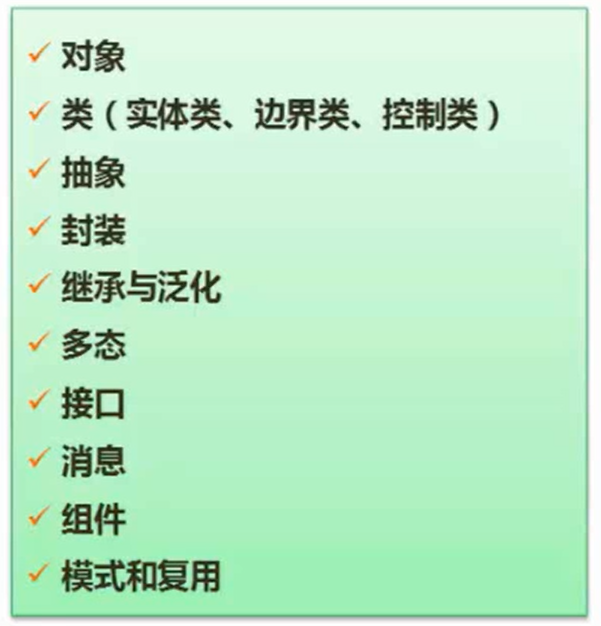
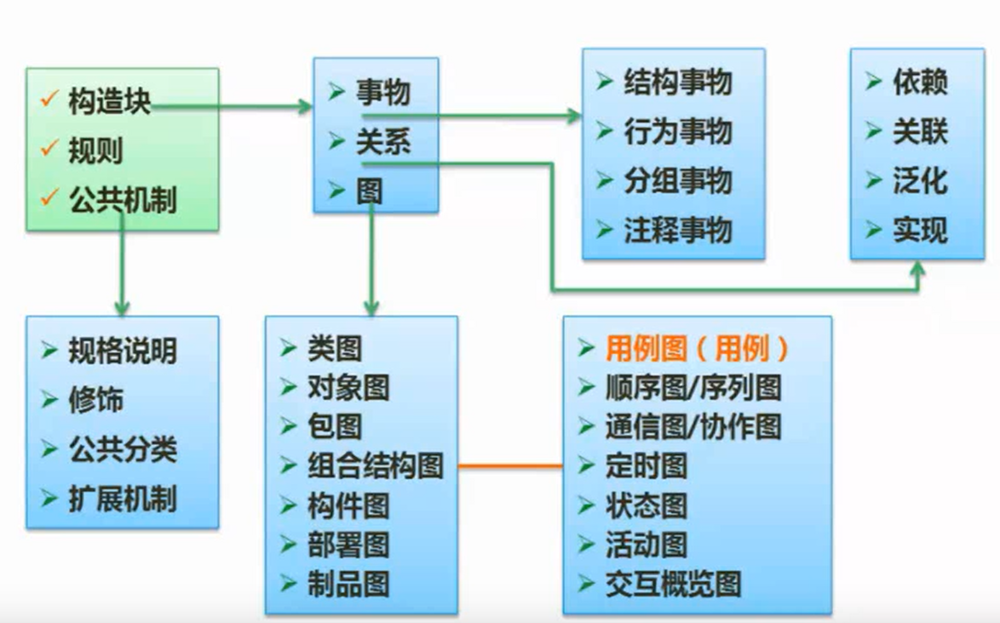
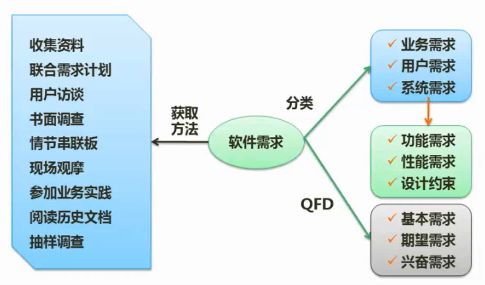

```yaml
title: 软件工程 
author: samin
date: 2021-08-03
```

# 开发方法


结构化法的缺点是一旦开发完成，流程固定，难以迭代

原型法比较解决敏捷开发

# 开发模型


## 瀑布模型（SDLC）


结构化方法模型、成本高、开发周期长

定义阶段、开发阶段、维护阶段

## 其他经典模型


原型法：先快速开发一个原型，用于展示，用于沟通

## 螺旋模型


引入了风险分析

## V模型


- 测试更重要

- 需求分析和验收测试有对应的关系
需求分析的时候写验收测试和系统测试，会提前暴露很多问题

- 概要设计的时候编写集成测试

- 详细设计的时候编写单元测试

## 构件组装模型（CBSD）



提高了软件的复用性

提高可靠性（每个构件在以前的系统中已经经过长久的迭代）

## 统一过程（UP / RUP）



## 敏捷开发方法



敏捷开发模型不止一个，符合敏捷开发宣言（十二原则）的都是敏捷开发模型

适合做一些小型项目

# 逆向工程



# 需求分析



## UML



UML 是一个工具箱，表达不同的内容用不同的图

一共有 14 种图，分为结构（静态）图和行为（动态）图

用例图有歧义，大部分归为行为图，也有归为结构图，具体看情况而定

## 需求分类



